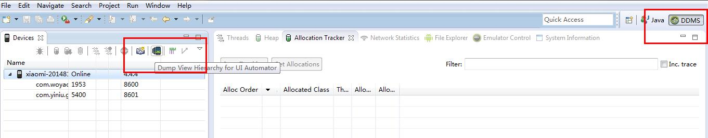
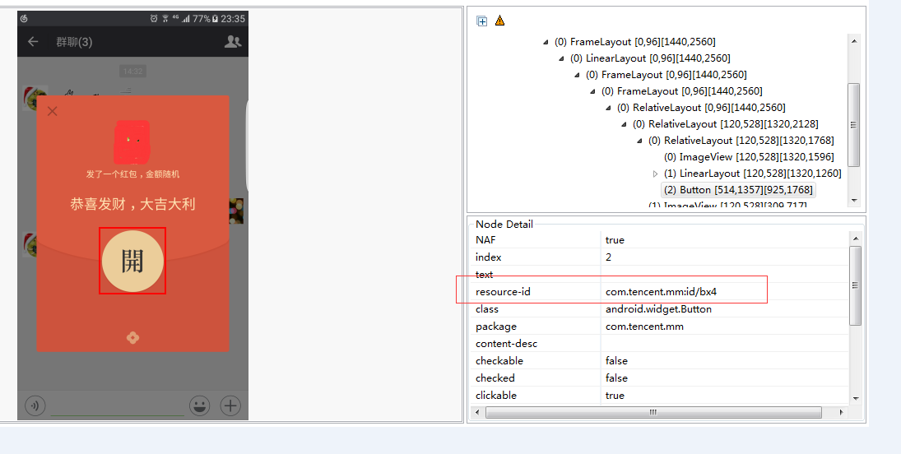
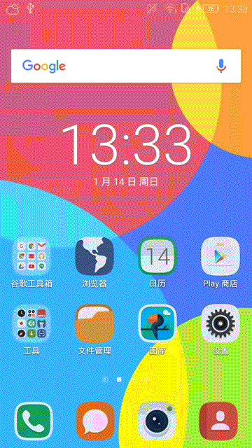

## Android微信抢红包插件原理和实现 适配微信6.6.1版本 ##

### 一、前言 ###

年关将至，小伙伴们又聊起了春节长假的旅行安排和各自家乡的年味习俗，不一而足。其中在各个微信群聊中抢红包也是为大家所津津乐道的。有时，可能因为手动去抢红包速度慢了，产生分分钟与一个亿差肩而过的遗憾。而这个时候，有小伙伴建议可以写一个微信自动抢红包的插件，这引起了我的兴趣，也就有了今天这篇文章。

依稀记得，微信红包插件在几年前就有了。本人曾经在CSDN上看到四哥写的微信红包插件的文章介绍，大致了解其中的原理。实际上就是通过**AccessibilityService**来监听出现新的红包后页面内容的变化和模拟点击，实现拆开红包。

### 二、原理解析 ###

#### 关于AccessibilityService ####
官网是这样介绍的

Accessibility services should only be used to assist users with disabilities in using Android devices and apps. They run in the backgro	und and receive callbacks by the system when AccessibilityEvents are fired. Such events denote some state transition in the user interface, for example, the focus has changed, a button has been clicked, etc.

上面大概的意思就是**AccessibilityService**是一个辅助服务，可用来帮助残障人士使用Android设备，对页面的内容变化做出相应的处理等。

[AccessibilityService的内容描述](https://developer.android.google.cn/reference/android/accessibilityservice/AccessibilityService.html) 

官网上对于**AccessibilityService**的内容介绍和API描述

[AccessibilityService的示例代码](https://developer.android.google.cn/guide/topics/ui/accessibility/index.html) 

官网上关于**AccessibilityService**的示例代码

### 三、开发思路 ###

- 通过注册**AccessibilityService**来监听通知栏和页面内容变化事件
- 通过系统提供的`findAccessibilityNodeInfosByText`和`findAccessibilityNodeInfosByViewId`来获取页面具体的控件对象
- 通过`performAction(AccessibilityNodeInfo.ACTION_CLICK)`方法来模拟点击事件

**注意：**

微信默认当有新的消息（包括红包）如果不在对应的聊天页面，那么新的消息将通过通知栏弹出，所以当我们在微信的消息列表页面或者对应的聊天页面时 可以直接通过当前页面内容的变化来判断是否出现新的红包或者改红包是否已经领取过；

新版微信红包页面无法直接通过`findAccessibilityNodeInfosByText`来获取拆开红包的按钮，所以我们可以通过遍历页面内容的节点树来获取“拆”这个控件(具体请参考代码实现)，模拟触发点击事件，来领取红包；

关于手机锁屏问题，当触发微信红包消息事件时，我们可以通过添加解开屏幕来跳转；部分机型和添加密码的手机可以通过发送提醒声来告知用户出现新的红包啦！！！

### 四、逻辑实现 ###

#### 集成AccessibilityService类 ####

1、 新建一个继承自AccessibilityService的类，然后在AndroidManifest文件中进行注册，如下：
	        
		<service
            android:name="com.mm.plugin.LMPAccessibilityService"
            android:enabled="true"
            android:exported="true"
            android:label="@string/service_name"
            android:permission="android.permission.BIND_ACCESSIBILITY_SERVICE">
            <intent-filter>
                <action android:name="android.accessibilityservice.AccessibilityService"/>
            </intent-filter>

            <meta-data
                android:name="android.accessibilityservice"
                android:resource="@xml/plugin_service_config"/>
        </service>

注意，在AndroidManifest文件声明配置文件是在4.0以后的写法，之前的SDK需要直接在代码中配置。

还需要声明一个权限：

`android:permission="android.permission.BIND_ACCESSIBILITY_SERVICE"`

2、 添加该服务的配置文件，位于`res/xml`文件夹下：

	
    <?xml version="1.0" encoding="utf-8"?>
    <accessibility-service
    xmlns:android="http://schemas.android.com/apk/res/android"
    android:accessibilityEventTypes="typeNotificationStateChanged|typeWindowStateChanged|typeWindowContentChanged|typeWindowsChanged"
    android:accessibilityFeedbackType="feedbackGeneric"
    android:accessibilityFlags="flagDefault"
    android:canRetrieveWindowContent="true"
    android:description="@string/accessibility_description"
    android:notificationTimeout="100"
    android:packageNames="com.tencent.mm"/>

> android:accessibilityEventTypes="typeNotificationStateChanged|typeWindowStateChanged|typeWindowContentChanged|typeWindowsChanged"

服务接收的响应事件类型；

> android:accessibilityFeedbackType="feedbackGeneric"

响应的反馈方式；

> android:description="@string/accessibility_description"

在手机设置中开启服务的描述内容；

> android:notificationTimeout="100"

响应时间；

> android:packageNames="com.tencent.mm"

服务接收指定的应用时间，这里我们默认只接收微信

3、在LMPAccessibilityService类中部分逻辑实现

    @Override
    public void onAccessibilityEvent(AccessibilityEvent event) {
		//接收事件,如触发了通知栏变化、界面变化等	
    }
    
    @Override
    protected boolean onKeyEvent(KeyEvent event) {
        //接收按键事件
        return super.onKeyEvent(event);
    }

    @Override
    public void onInterrupt() {
	  //服务中断，如授权关闭或者将服务杀死
    }

    @Override
    protected void onServiceConnected() {
        super.onServiceConnected();
        //连接服务后,一般是在授权成功后会接收到
    }

4、关于界面内容变化和抢红包核心业务逻辑

在辅助服务中AccessibilityEvent事件中的处理：

        //通知栏事件
        if (eventType == AccessibilityEvent.TYPE_NOTIFICATION_STATE_CHANGED) {
            Parcelable data = event.getParcelableData();
            if (data == null || !(data instanceof Notification)) {
                return;
            }
            if (LMPAccessibilityService.isNotificationServiceRunning() && getConfig()
                    .isEnableNotificationService()) { //开启快速模式，不处理
                return;
            }
            List<CharSequence> texts = event.getText();
            if (!texts.isEmpty()) {
                String text = String.valueOf(texts.get(0));
                notificationEvent(text, (Notification) data);
            }
        } else if (eventType == AccessibilityEvent.TYPE_WINDOW_STATE_CHANGED) {
            // 这里同一个应用内 如果页面内容没有变化的话是没有执行的
            Log.e(TAG, "TYPE_WINDOW_STATE_CHANGED");
            onWindowStateChanged(event);
        } else if (eventType == AccessibilityEvent.TYPE_WINDOW_CONTENT_CHANGED) {
            // 这里只要页面内容变化 就会执行 例如不同应用之间的跳转
            Log.e(TAG, "TYPE_WINDOW_CONTENT_CHANGED");
            if (mCurrentWindow != WINDOW_LAUNCHER) { //不在聊天界面或聊天列表，不处理
                return;
            }
            handleChatListHongBao();
        }
在通知栏中过滤微信红包消息：

    /**
     * 通知栏事件
     */
    private void notificationEvent(String ticker, Notification nf) {
        String text = ticker;
        int index = text.indexOf(":");
        if (index != -1) {
            text = text.substring(index + 1);
        }
        text = text.trim();
        if (text.contains(HONGBAO_TEXT_KEY)) { //红包消息
            handleNewHongBaoNotification(nf);
        }
    }

对通知栏和页面变化的逻辑处理：

    private void onWindowStateChanged(AccessibilityEvent event) {
        Log.d(TAG, event.getClassName() + "");
        if (wxHongbaoPageName.equals(event.getClassName())) {
            mCurrentWindow = WINDOW_LUCKYMONEY_RECEIVEUI;
            //点中了红包，下一步就是去拆红包
            openHongbao();
        } else if (wxHongbaoDetailsPageName.equals(event.getClassName())) {
            mCurrentWindow = WINDOW_LUCKYMONEY_DETAIL;

            if (curHongbaoNotificationList.size() == 0) {
                // 设置当前是否需要领取红包状态为否 后续重新接收新的领取红包事件
                isReceivingHongbao = false;
                //拆完红包后看详细的纪录界面 在这里可以返回到当前的上一个页面
                if (getConfig().getWechatAfterGetHongBaoEvent() == Config.WX_AFTER_GET_GOHOME) {
                    //返回主界面，以便收到下一次的红包通知
                    AccessibilityHelper.performHome(getService());
                } else {
                    // 返回到上个页面
                    AccessibilityHelper.performBack(getService());
                }
            } else {
                for (int i = 0; i < curHongbaoNotificationList.size(); i++) {
                    openHongbaoPage4Notification(curHongbaoNotificationList.get(i));
                }
            }

        } else if (wxChatPageName.equals(event.getClassName())) {
            mCurrentWindow = WINDOW_LAUNCHER;
            //在聊天界面,去点中红包
            handleChatListHongBao();
        } else {
            mCurrentWindow = WINDOW_OTHER;
        }
    }

上文提到的，新版微信已经不支持通过获取文本内容来定位到拆开按钮，所以我们直接通过遍历节点树来获取具体的控件模拟点击”开“按钮：

    /**
     * 点击聊天里的红包后，显示的界面
     */
    @TargetApi(Build.VERSION_CODES.JELLY_BEAN)
    private void openHongbao() {
        AccessibilityNodeInfo nodeInfo = getService().getRootInActiveWindow();
        if (nodeInfo == null) {
            Log.w(TAG, "rootWindow为空");
            return;
        }

        AccessibilityNodeInfo targetNode = null;

        int event = getConfig().getWechatAfterOpenHongBaoEvent();
        int wechatVersion = getWechatVersion();
        if (event == Config.WX_AFTER_OPEN_HONGBAO) { //拆红包
            // 通过遍历当前页面的节点树，获取到红包页面的“开”按钮
            if (wechatVersion == wx523VersionCode || wechatVersion == wx661VersionCode) {
                targetNode = AccessibilityHelper.findNodeInfosByClassName(nodeInfo, BUTTON_CLASS_NAME);
            } else {
                Log.d(TAG, "抱歉，暂时不支持该微信版本！");
                Toast.makeText(getContext(), "抱歉，暂时不支持该微信版本！", Toast.LENGTH_SHORT).show();
            }

        } else if (event == Config.WX_AFTER_OPEN_NONE) {
            return;
        }

        if (targetNode != null) {
            final AccessibilityNodeInfo n = targetNode;
            long sDelayTime = getConfig().getWechatOpenDelayTime();
            if (sDelayTime != 0) {
                getHandler().postDelayed(new Runnable() {
                    @Override
                    public void run() {
                        // 模拟拆开红包
                        AccessibilityHelper.performClick(n);
                    }
                }, sDelayTime);
            } else {
                // 模拟拆开红包
                AccessibilityHelper.performClick(n);
            }
        }
    }

至此，我们就完成了微信抢红包插件开发实现，以上代码适配了微信6.5.23和6.6.1版本。

另外我们还可以添加延时抢红包功能来防止封号和过滤群聊等功能~~。

亲测在小米、vivo等机型上可以完美运行，实现自动抢红包功能。

最后附上相关截图：

关于控件ID的获取，我们可以借助Android的DDMS工具里的`Dump View Hierarchy For UI Automator` 去分析微信UI结构。

这个ID就是我们上文提到的`findAccessibilityNodeInfosByViewId`方法中的参数。

最终效果

### 五、延展总结 ###

关于`AccessibilityService`这个类，我们来可以用来实现比如免root自动安装、虚拟按键操作等。

最后声明：本项目中用到的内容仅用作学习研究使用，对技术的可行性做相关探索，如果利用本文案例或者技术进行其他非法操作，带来的一切法律责任与本人无关！！！	

### 六、感谢 ###

本项目的代码是在一个开源项目进行修改和完善，感谢源码作者贡献和付出！！！

[原项目地址](https://github.com/lendylongli/qianghongbao)

在原基础上修改和添加的功能包括：

- 添加对微信5.23和6.6.1的版本的适配
- 添加了在微信信息列表页面和群聊、单聊页面的抢红包功能
- 优化了有新红包到拆开红包的逻辑
- 优化了短时间内出现多个红包后可能会出现漏抢的情况
- 修改了部分页面直接通过遍历页面控件方法来获取相应的目标控件

